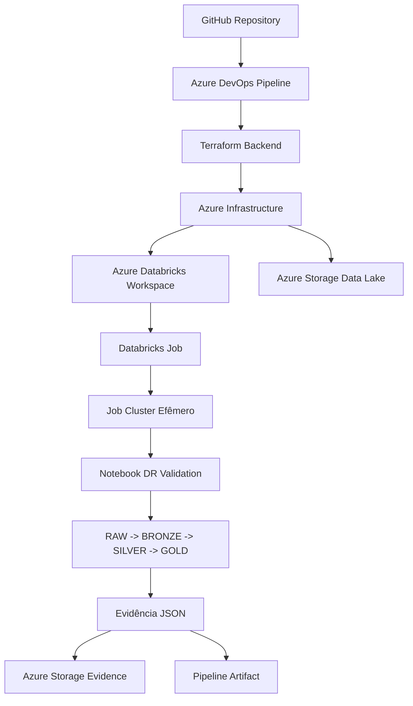
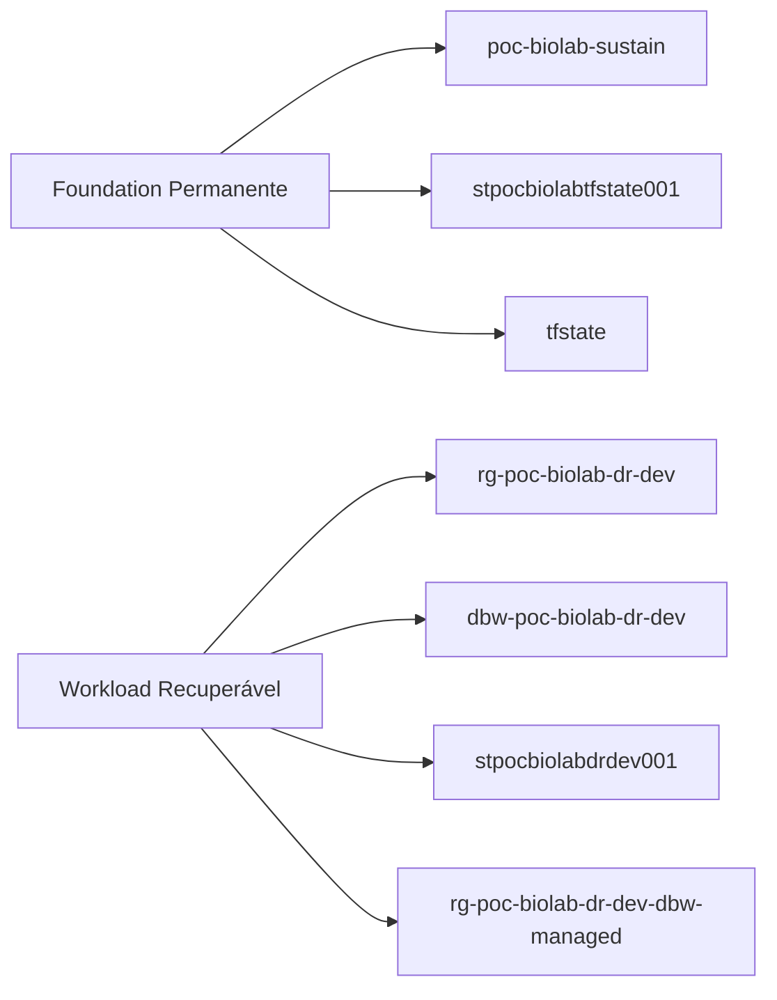
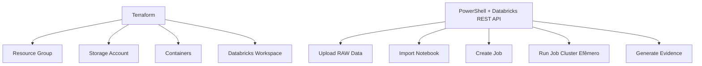
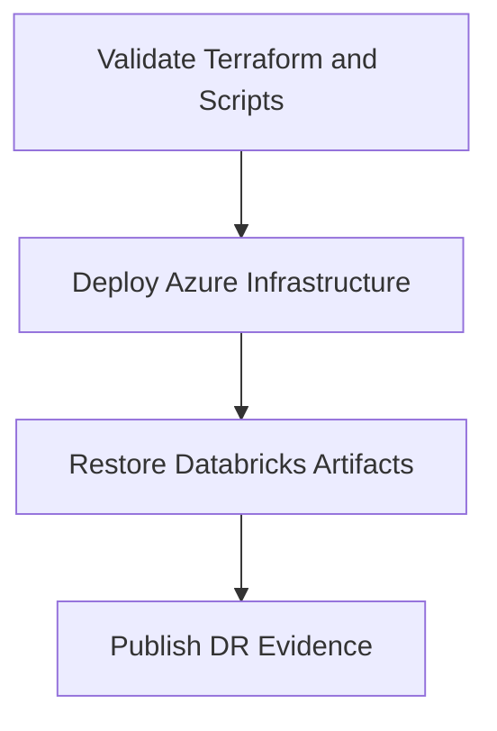
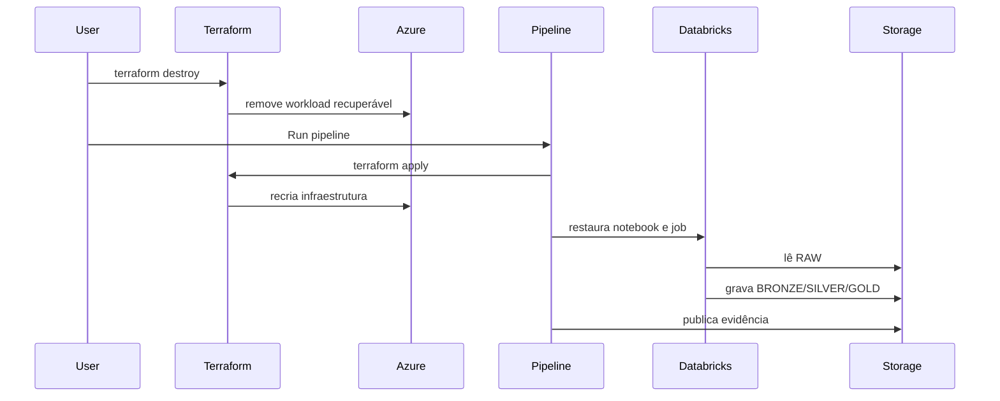

# POC BIOLAB - Azure Databricks Disaster Recovery

POC corporativa de Disaster Recovery para Azure Databricks com reconstrução automatizada via Azure DevOps Pipeline.

---

# Objetivo

Provar que é possível destruir e reconstruir do zero uma plataforma Azure Databricks funcional, incluindo:

- Infraestrutura Azure
- Azure Databricks Workspace
- Storage Account
- Containers RAW / BRONZE / SILVER / GOLD
- Notebooks
- Jobs
- Job Cluster efêmero
- Processamento de dados
- Evidências de restore

---

# Arquitetura geral



---

# Separação de recursos



---

# Foundation permanente

Recursos que NÃO devem ser apagados:

- Resource Group: `poc-biolab-sustain`
- Storage Account tfstate: `stpocbiolabtfstate001`
- Container: `tfstate`
- Azure DevOps Pipeline
- GitHub Repository

---

# Workload recuperável

Recursos que podem ser apagados e recriados:

- Resource Group: `rg-poc-biolab-dr-dev`
- Managed Resource Group Databricks: `rg-poc-biolab-dr-dev-dbw-managed`
- Azure Databricks Workspace: `dbw-poc-biolab-dr-dev`
- Storage Account: `stpocbiolabdrdev001`

Containers:

- `raw`
- `bronze`
- `silver`
- `gold`
- `artifacts`
- `evidence`
- `logs`

---

# Estratégia técnica



---

# Sobre o Compute

A POC NÃO mantém All-purpose Compute permanente.

O Job usa Job Cluster efêmero:

- nasce automaticamente durante a execução do Job
- executa o notebook
- é encerrado automaticamente
- não aparece como All-purpose Compute permanente

Por isso a tela Compute pode ficar vazia após a execução. Isso é esperado.

---

# Fluxo Medallion


Entradas:

- `raw/customers/customers.csv`
- `raw/sales/sales.csv`

Saídas:

- `bronze/customers`
- `bronze/sales`
- `silver/sales_customer`
- `gold/customer_revenue`
- `gold/state_revenue`

---

# Pipeline

Arquivo:

```text
.azuredevops/azure-pipelines.yml
```

Stages:

1. Validate Terraform and Scripts
2. Deploy Azure Infrastructure
3. Restore Databricks Artifacts
4. Publish DR Evidence

---

# Pipeline Flow



---

# Evidência esperada

Artifact final:

```text
databricks-dr-evidence-final/databricks-restore-evidence.json
```

Campos esperados:

```json
{
  "restore_status": "SUCCESS",
  "run_life_cycle_state": "TERMINATED",
  "run_result_state": "SUCCESS"
}
```

---

# Teste completo de DR



---

# Como executar o teste

## 1. Destruir workload recuperável

```powershell
cd C:\Projetos\poc_biolab\terraform\10-dr-workload

terraform destroy -var-file="dev.tfvars"
```

Confirmar com:

```text
yes
```

---

## 2. Validar que o workload foi apagado

```powershell
az group show --name rg-poc-biolab-dr-dev -o table

az group show --name rg-poc-biolab-dr-dev-dbw-managed -o table
```

O esperado é que ambos não existam.

---

## 3. Validar que a foundation continua

```powershell
az group show --name poc-biolab-sustain -o table

az storage account show `
  --name stpocbiolabtfstate001 `
  --resource-group poc-biolab-sustain `
  -o table
```

---

## 4. Reexecutar o pipeline

Azure DevOps:

```text
Pipelines -> Run pipeline
```

---

## 5. Validar resultado

Validar:

- Pipeline verde
- Artifact final publicado
- JSON com `restore_status = SUCCESS`
- Storage com containers RAW/BRONZE/SILVER/GOLD
- Job Databricks com último run SUCCESS
- Compute vazio após execução

---

# Resultado final

Esta POC prova:

- reconstrução automatizada do Azure Databricks
- separação entre foundation e workload recuperável
- Terraform remoto com backend resiliente
- pipeline one-click deploy and restore
- execução real de dados com Spark
- arquitetura Medallion
- evidência auditável do restore
- recuperação completa após destruição do workload